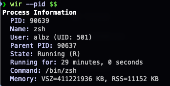
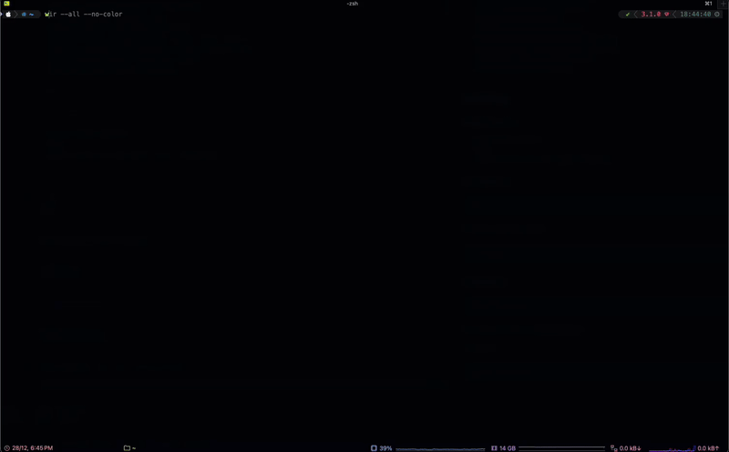

# wir - What Is Running
[](https://github.com/AlbertoBarrago/wir/actions/workflows/release.yml)

A cross-platform CLI tool written in C to inspect what's running on specific ports and explain process details.



## Demo



## Features

- Check what process is using a specific port
- Get detailed information about a process by PID
- List all running processes on the system
- Show full process ancestry tree
- Display process environment variables
- Interactive mode to kill processes with a keypress
- **Human-readable process states** (e.g., "Running (R)" instead of just "R")
- **Process uptime tracking** - see how long a process has been running
- Multiple output formats (normal, short, JSON, tree)
- Security warnings for potentially risky configurations
- Cross-platform support (macOS and Linux)
- Colorized output (can be disabled)

## Installation

### Via Homebrew (macOS)

```bash
brew tap AlbertoBarrago/tap
brew install wir
```

### Building from Source

#### Requirements

- GCC or Clang compiler
- Make
- macOS 10.10+ or Linux with `/proc` filesystem

#### Compilation

```bash
make
```

For debug build with symbols:

```bash
make debug
```

#### Install

```bash
sudo make install
```

This installs `wir` to `/usr/local/bin`.

To uninstall:

```bash
sudo make uninstall
```

## Usage

```
wir [OPTIONS]
```

### Options

- `--pid <n>` - Explain a specific PID
- `--port <n>` - Explain port usage
- `--all` - List all running processes
- `--short` - One-line summary
- `--tree` - Show full process ancestry tree
- `--json` - Output result as JSON
- `--warnings` - Show only warnings (port mode only)
- `--no-color` - Disable colorized output
- `--env` - Show only environment variables (PID mode only)
- `--interactive` or `-i` - Enable interactive mode (kill process with 'k' or 'q' to quit)
- `--help` - Show help message

### Examples

#### Check what's running on port 8080

```bash
wir --port 8080
```

#### Get info about a specific process

```bash
wir --pid 1234
```

#### Show process ancestry tree

```bash
wir --pid 1234 --tree
```

#### Show environment variables

```bash
wir --pid 1234 --env
```

#### JSON output for scripting

```bash
wir --port 3000 --json
```

#### Short one-line summary

```bash
wir --pid 5678 --short
```

#### Check for security warnings

```bash
wir --port 8080 --warnings
```

#### List all running processes

```bash
wir --all
```

#### List all processes (short format)

```bash
wir --all --short
```

#### Interactive mode - kill a process

```bash
wir --pid 1234 --interactive
# or
wir --port 8080 -i
```

Press 'k' to kill the process, 'q' to quit without killing, or any other key to exit.

## How It Works

### On Linux

- Parses `/proc/net/tcp` and `/proc/net/tcp6` for network connections
- Reads `/proc/[pid]/` files for process information
- Maps socket inodes to PIDs by scanning `/proc/[pid]/fd/*`

### On macOS

- Uses `libproc` and `sysctl()` for process information
- Falls back to `lsof` for network connection information
- Uses `proc_pidinfo()` for detailed process data

## Platform-Specific Notes

### Linux

- Reading network connections typically requires root privileges
- Environment variables can only be read for processes you own or if running as root

### macOS

- Some process information may be restricted by System Integrity Protection (SIP)
- Reading environment variables of other processes is limited

## Architecture

The codebase is organized into modular components:

- `main.c` - Program entry point and orchestration
- `args.c/h` - Command-line argument parsing
- `utils.c/h` - Common utilities (colors, memory, strings)
- `platform.c/h` - Platform abstraction layer (handles Linux/macOS differences)
- `output.c/h` - Output formatting (normal, short, tree, JSON)

## Learning C with Wir

This project demonstrates several C programming concepts:

1. **Memory Management** - All allocations are checked, all memory is freed
2. **Error Handling** - Consistent error checking with return codes
3. **Modular Design** - Clear separation of concerns
4. **Platform Abstraction** - Conditional compilation for cross-platform support
5. **System Programming** - `/proc` filesystem, system calls, process management
6. **String Handling** - Safe string operations and buffer management
7. **Build Systems** - Makefile with platform detection

## Contributing

This is a learning project. Feel free to experiment and extend it:

- Add UDP port support
- Implement process filtering
- Add more output formats
- Support for other platforms (BSD, etc.)
- Performance optimizations

## License

This project is provided as-is for educational purposes.

## Troubleshooting

### "Permission denied" errors

Many operations require elevated privileges. Try running with `sudo`:

```bash
sudo wir --port 80
```

### "No connections found"

- Make sure the port is actually in use: `netstat -an | grep <port>`
- Try running with sudo if checking privileged ports (1-1023)

### Build errors

- Ensure you have a C11-compatible compiler
- On macOS, install Xcode Command Line Tools: `xcode-select --install`
- On Linux, install build-essential: `sudo apt-get install build-essential`

## Acknowledgments

Built as a learning project to understand system programming in C.
